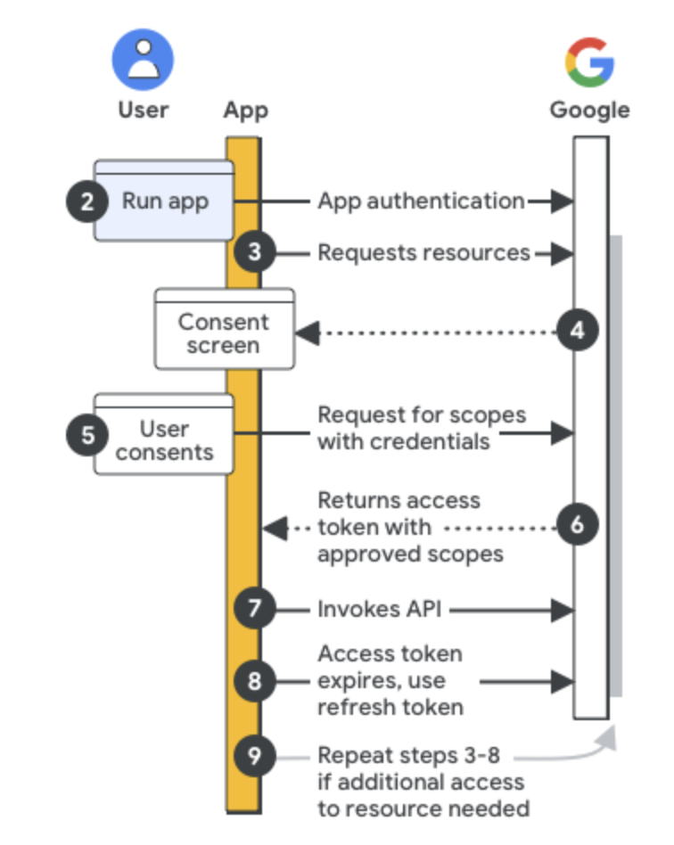

# Senior Systems Engineer Technical Assessment


This repository contains Python scripts for the Senior Systems Engineer Technical Assessment at Netflix. This project provides scripts to analyze and copy folders in Google Drive using the Google Drive v3 API. It consists of three main assessments, each performing a specific task.

## Prerequisites

- A personal Gmail account with Google Drive enabled
- A Google Cloud Platform (GCP) project
- Python 3.9+ installed on a Unix-based or MacOS system
- Client credentials for GCP project
- [pip](https://pypi.python.org/pypi/pip) (Package Management Tool)
- Source Folder ID
- Destination Folder ID

## Initial Steps
1) Enable the API : Before using Google APIs, you need to turn them on in a Google Cloud project. In the Google Cloud console, [enable the Google Drive API](https://console.cloud.google.com/flows/enableapi?apiid=drive.googleapis.com).
2) Configure the OAuth consent screen : In the Google Cloud console, go to Menu menu > APIs & Services > [OAuth consent screen](https://console.cloud.google.com/apis/credentials/consent). Then go to OAuth consent screen
   For User type select Internal, then click Create.
   Complete the app registration form, then click Save and Continue.
   ** Note : For this project, I skipped adding scopes and clicked Save and Continue.
3) Authorize credentials for a desktop application
   To authenticate end users and access user data in your app, you need to create one or more OAuth 2.0 Client IDs. A client ID is used to identify a single app to Google's OAuth servers.
   In the Google Cloud console, go to Menu menu > APIs & Services > Credentials.
   [Go to Credentials](https://console.cloud.google.com/apis/credentials)

   - Click Create Credentials > OAuth client ID.
   - Click Application type > Desktop app.
   - In the Name field, type a name for the credential. This name is only shown in the Google Cloud console.
   - Click Create. The OAuth client created screen appears, showing your new Client ID and Client secret.
   - Click OK. The newly created credential appears under OAuth 2.0 Client IDs.
   - Save the downloaded JSON file as credentials.json, and move the file to your working directory.
   - Review the app registration summary. To make changes, click Edit. If the app registration looks OK, click Back to Dashboard.

## Getting Started
1) Create the destination folder 

   ```python
   python setup.py

2) Run each assessment#.py file

   ```python
   python assessment1.py
   python assessment2.py
   python assessment3.py

## Project Structure

```
├── README.md
├── assessment1.py : Generates report that shows the number of files and folders in total at the root of the source folder
├── assessment2.py : Generates a report that show the number of child objects (recursively) for each top-level folder under the source folder id and a total of nested folders for the source folder
├── assessment3.py : Copies the content (nested files/folders) of the source folder to the destination folder
├── utils.py : Contains helper functions
├── config.py : Contains configuration details
├── requirements.txt : Required python libraries 
├── setup.py : Setup the destination folder and get Google Drive API token
├── analysis : Scripts for analyzing folders
├── public : Image files 
├── docker : Sample dockerfile for GKS
├── reports : Reports generated by asssessment1-3.py
   ├── assessment1_report.json
   ├── assessment2_report.csv
   ├── assessment3_report.log
```

## Notes

- These scripts are designed to run on Unix-based or MacOS systems.

## Future Enhancements
1) Create Github Actions to perform Google API tasks - must be fast jobs (limited by Github resources allocated)
2) Can create a Dockerfile for more advanced tasks or moving bigger jobs to GKS
3) Add a dashboard, Python Graph, or website (Firebase UI) to visualize the data using Grafana or Prometheus 
4) Add more logging to use for data needed to create self-healing
5) Add feature to send scheduled email reports
6) Use Google Function to scheduled runs
7) Log actions to a database for rollback or replaying changes

## References

1. [Google Drive API v3 Documentation](https://developers.google.com/drive/api/v3/about-sdk)
2. [Python Quickstart for Google Drive API](https://developers.google.com/drive/api/quickstart/python)
3. [Authentication and Authorization for Google APIs](https://developers.google.com/identity/protocols/oauth2)
4. [Google OAuth 2.0 Playground](https://developers.google.com/oauthplayground/)
5. [Working with Google Drive folders](https://developers.google.com/drive/api/v3/folder)
6. [Search for files and folders](https://developers.google.com/drive/api/v3/search-files)
7. [Download files](https://developers.google.com/drive/api/v3/manage-downloads)
8. [Upload files](https://developers.google.com/drive/api/v3/manage-uploads)
9. [Google Cloud Platform](https://cloud.google.com/)
10. [Google Workspace API Workflow](https://developers.google.com/workspace/guides/auth-overview)
11. [Google Drive List files](https://developers.google.com/drive/api/reference/rest/v3/files/list)
12. [Google Drive MimeTypes](https://developers.google.com/drive/api/guides/mime-types)


How Google Workspace API Works:
[](https://developers.google.com/workspace/guides/auth-overview)